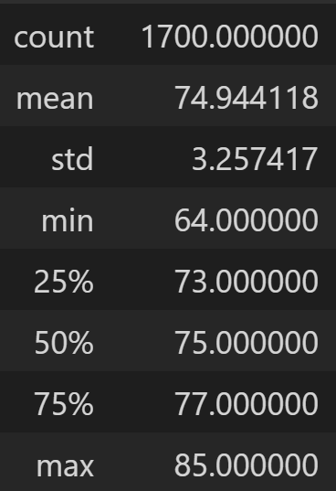
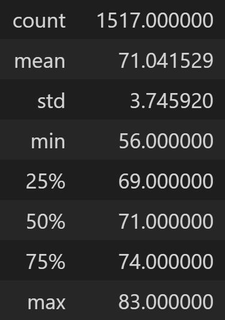

# Surfs Up - A Weather Analysis
## Overview of Project
### Background
This project was conducted for investors that are interested in opening a surf & shake shop on the Hawaiian island Oahu. More specifically, the investors were curious about the weather patterns on Oahu, as they may affect the business's success.

## Purpose
The purpose of the analyses presented here was to look at weather differences between June and December to determine if the proposed shop would be sustainable year-round. This was done by running two separate queries: one for June and one for December. These results were put into lists which were then converted to dataframes, and summary statistics were then generated for each month.

## Results
The following summary statistic tables were generated: 

*June Temperature Statistics*   

*December Temperature Statistics*   

Key takeaways based on the results in the tables:
1. The average temperatures for June and December differ very little, with June having an average temperature of 75 degrees and December having an average temperature of 71 degrees.
2. The maximum temperatures for June and December are also very similar, with June's maximum temperature being 85 degrees and December's being 83 degrees. 
3. The minimum temperatures for June and December show a larger difference, with June's minimum temperature being 64 degrees and December's being 56 degrees. 

## Summary
The temperatures in June and December are much the same, however December has a slightly greater range of temperatures. The lowest temperature in December is 8 degrees colder than the lowest temperature in June. 

Additional queries could be executed in order to get a more comprehensive overview of the year-round weather. For example, a similar query could be run on the precipitation data for June and December to determine if one season is rainier than the other, as rain would likely impact both the shake and the surf aspects of the business. In addition, a query could be run that analysed the June and December data only from weather stations that are near a proposed location for the shop, as different areas of the island may experience slightly different weather patterns. 